# HeightmapGeographicalInformation
>  从高度信息生成各种地理信息

## 源高度图

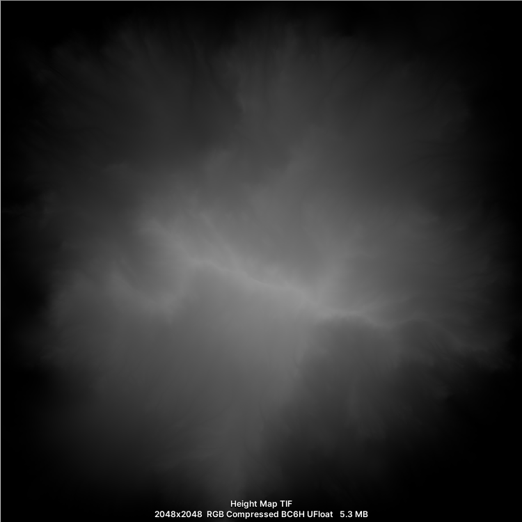

## 法线图

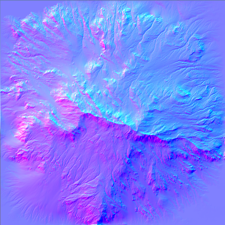

## 纵横图

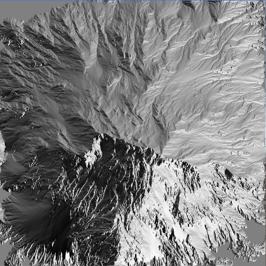

## 坡度图

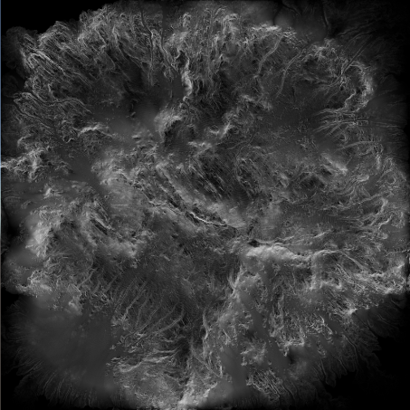

## 流量图

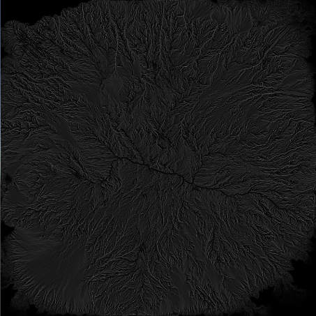

## 残差图

海拔

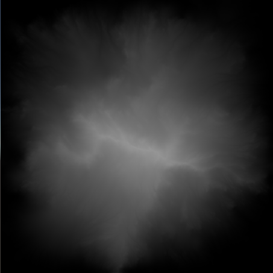

平均值

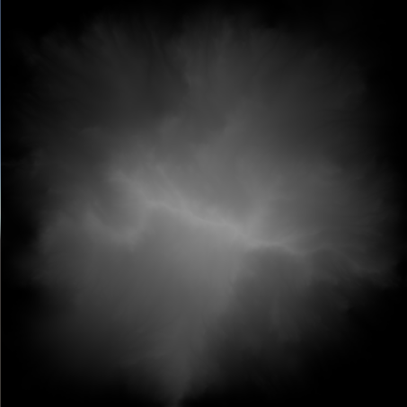

标准差

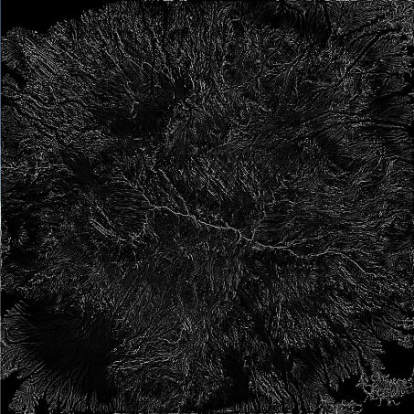

偏差

百分数

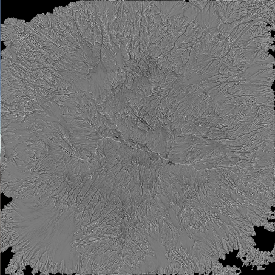

## 地形图

堆积地貌

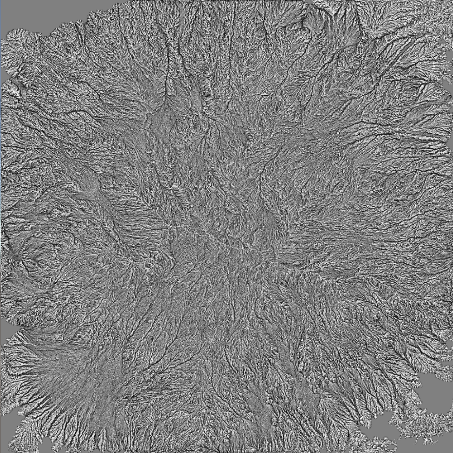

高斯

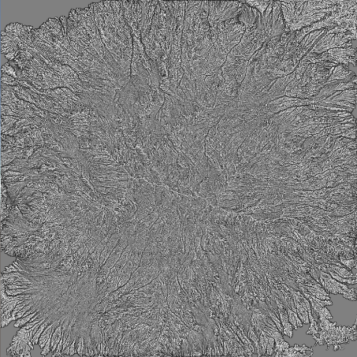

形状指数

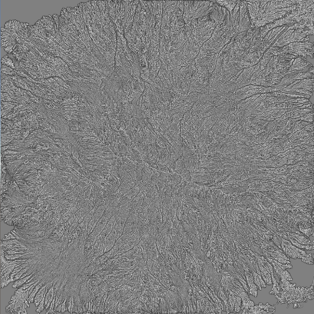

## 曲率图

累积曲率

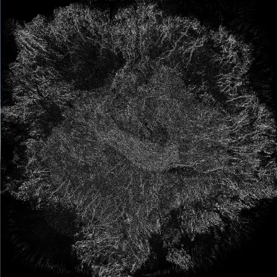

差异曲率

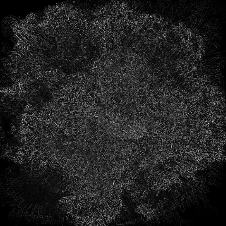

高斯曲率

水平曲率

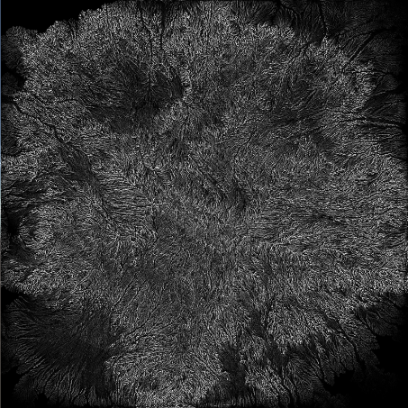

水平超曲率

最大曲率

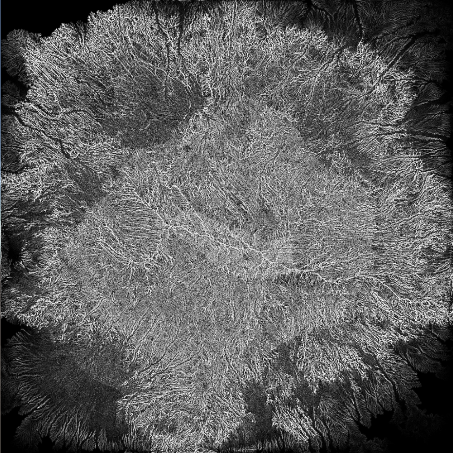

平均曲率

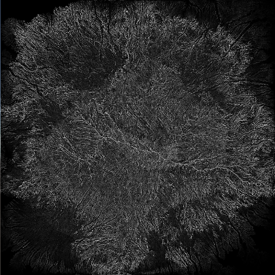

最小曲率

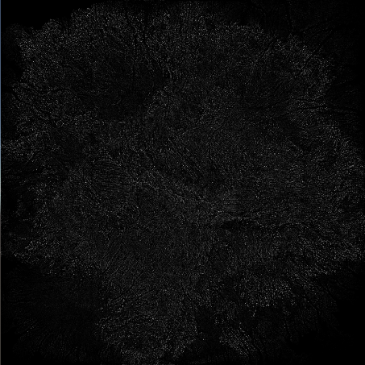

平面曲率

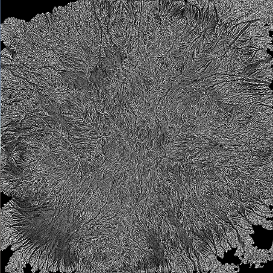

环曲率

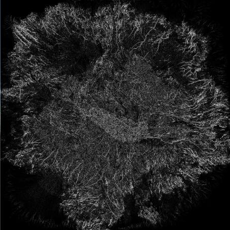

转子曲率

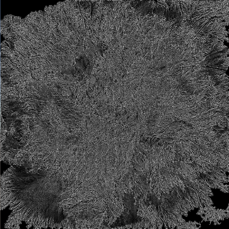

非球面曲率

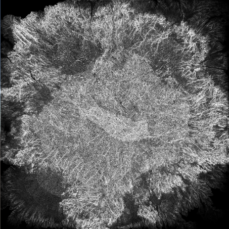

垂直曲率

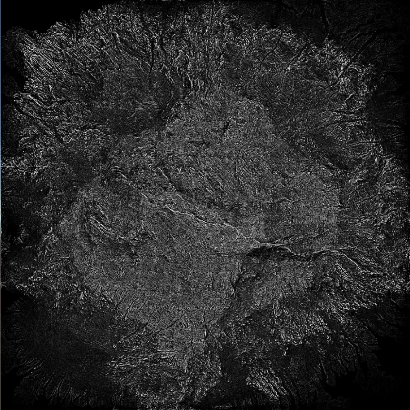

垂直超曲率

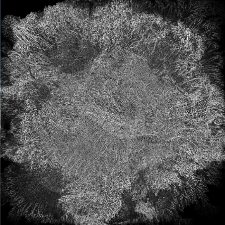

算法来自[这里](https://github.com/Scrawk/Terrain-Topology-Algorithms)，我创建了这些算法的JobSystem版本，计算速度可以支持在运行时实时生成。
